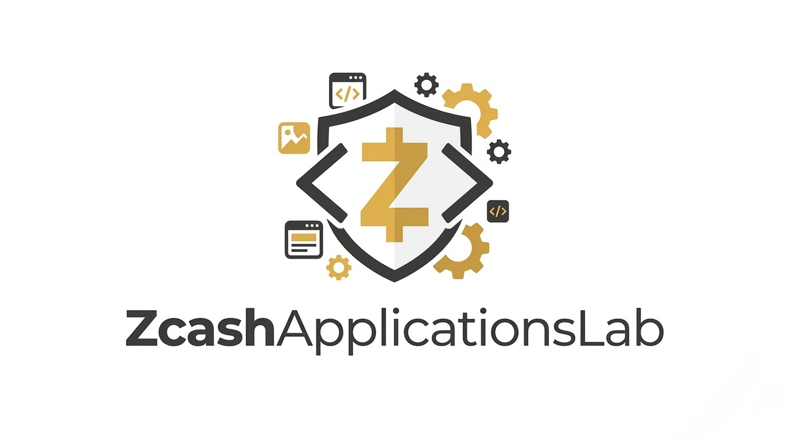

  

<h1 align="center">Zcash Applications Lab</h1>

  <em>A continuous open-source hackathon for privacy-preserving applications beyond payments.</em>

  <a href="https://github.com/ZcashApplicationsLab/lab/issues/new?template=sprint-proposal.yml"><strong>Propose a sprint →</strong></a>
  ·
  <a href="BACKLOG.md">Backlog</a>
  ·
  <a href="RUBRIC.md">Evaluation rubric</a>
  ·
  <a href="GOVERNANCE.md">Governance</a>

> **Status: early community experiment.** This is an unfunded, independent effort by a small group of builders. It is **not affiliated with, endorsed by, or operated on behalf of** the Zcash Foundation (ZF), Zcash Community Grants (ZCG), Shielded Labs, or ZOLD. There is no budget and no formal partnership. We are sharing this publicly to gather feedback and see if the format is useful. If you think it is, or think it is not, open a [Discussion](https://github.com/ZcashApplicationsLab/lab/discussions).

---

## Why this exists

Zcash has strong privacy primitives but a thin layer of working applications beyond private payments. There are many ideas and few shipped prototypes. Funding bodies like ZCG see a lot of proposals and have to evaluate them largely on intent.

ZAL is an attempt at a lightweight incubation format: ideas in, open-source code out. Time-boxed sprints produce working prototypes with full writeups, so a proposer can point at a track record instead of a pitch deck if they later apply for grants anywhere.

We are not a grants body, not a research lab, not a product studio. We are a builder-first sandbox for the Zcash application space, and for now a proposal looking for feedback.

## What we ship

Every sprint produces:

- **Working code**: runnable prototype, Apache 2.0 licensed, in a dedicated repo under this org.
- **Specification**: what it does, threat model, protocol sketch.
- **Writeup**: design choices, tradeoffs, open questions.
- **Demo**: CLI, web, or video walkthrough.
- **Retrospective note**: next steps, open questions, where the author plans to take it next (if anywhere).

See [SPRINT_WRITEUP_TEMPLATE](docs/SPRINT_WRITEUP_TEMPLATE.md) for the output format.

## The seven verticals

| #   | Vertical                                    | Problem                                                                                                   |
| --- | ------------------------------------------- | --------------------------------------------------------------------------------------------------------- |
| 1   | Verifiable Credentials & Identity           | NFC passports, diplomas, KYC proofs on Zcash, with selective disclosure that does not reveal the document |
| 2   | Private Credit & Underwriting               | Credit history, scoring, and lending with shielded counterparties                                         |
| 3   | Regulated Privacy & Selective Disclosure    | View keys, auditor keys, compliance-ready privacy for regulated flows                                     |
| 4   | Institutional Settlement & Proof of Reserve | Treasury ops, PoR, private settlement rails                                                               |
| 5   | RWA Attestations                            | Tokenized real-world asset attestations with privacy defaults                                             |
| 6   | Private Voting & DAO Governance             | Shielded voting, delegation, quadratic funding                                                            |
| 7   | ZK Audits & Privacy-Preserving Analytics    | Audit trails, compliance reports, and analytics that preserve confidentiality                             |

Backlog items under each vertical live in [BACKLOG.md](BACKLOG.md).

## How it works

1. **Propose.** Open a [Sprint Proposal](https://github.com/ZcashApplicationsLab/lab/issues/new?template=sprint-proposal.yml) issue. Scope is 2 to 4 weeks, one concrete deliverable.
2. **Triage.** The current maintainer group evaluates against the [RUBRIC](RUBRIC.md): relevance, feasibility, team, defensibility, next-step clarity.
3. **Sprint.** If accepted, the team gets a repo under `ZcashApplicationsLab/<project>` and a named reviewer. Weekly [Sprint Update](https://github.com/ZcashApplicationsLab/lab/issues/new?template=sprint-update.yml) posts.
4. **Ship.** Code, spec, writeup, demo, retrospective. [Sprint Writeup](https://github.com/ZcashApplicationsLab/lab/issues/new?template=sprint-writeup.yml) closes the loop.
5. **Keep going (or not).** The author decides what to do next with the artifact: continue as an independent project, apply for grants elsewhere, or leave it as a reference implementation. The lab does not claim credit for downstream outcomes.

We aim for two to three sprints in parallel once the format is validated. For now, capacity depends entirely on who shows up.

## Reference projects

- **ZAL-00: ZK ID + ZK Credit.** NFC passport proofs and private credit history on Zcash. Being developed independently by the initial maintainer group. Will be linked here once published under this org.

## Get involved

Help is welcome from anyone. ZAL is a volunteer effort, so there is no gatekeeping. You can contribute by proposing a sprint, running a sprint, reviewing code or writeups, mentoring active sprints, improving the docs, flagging prior art, or just giving honest feedback in a [Discussion](https://github.com/ZcashApplicationsLab/lab/discussions). Show up for one PR or stay for ten sprints, either is fine.

Rough role buckets:

- **Builders**: pick a backlog item or propose your own sprint.
- **Reviewers**: domain reviewers in cryptography, compliance, credit, identity, and governance are especially welcome.
- **Mentors**: time-boxed mentoring slots for active sprints.
- **Observers**: watch the repo, comment on writeups, no commitment needed.

Read [CONTRIBUTING.md](CONTRIBUTING.md) and [CODE_OF_CONDUCT.md](CODE_OF_CONDUCT.md) before opening your first issue or PR.

## License

All work in this org is Apache License 2.0 unless a sprint explicitly declares otherwise in its repo.

## Ecosystem context

Links to ecosystem organizations for orientation only. **No affiliation or endorsement is implied.**

- [Zcash Foundation (ZF)](https://zfnd.org/)
- [Zcash Community Grants (ZCG)](https://zcashcommunitygrants.org/)
- Shielded Labs
- ZOLD
